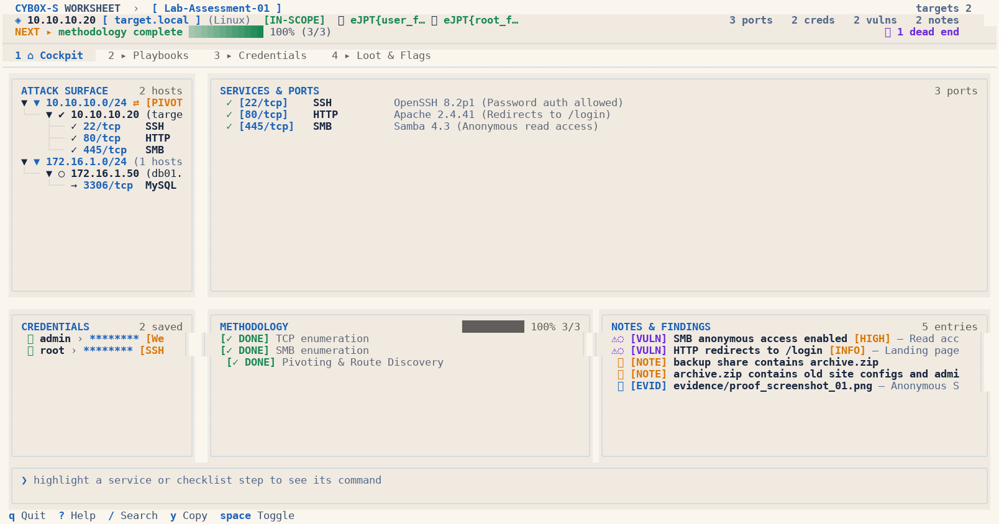
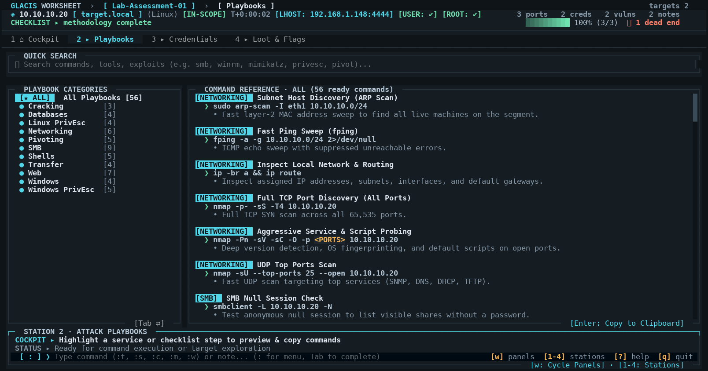
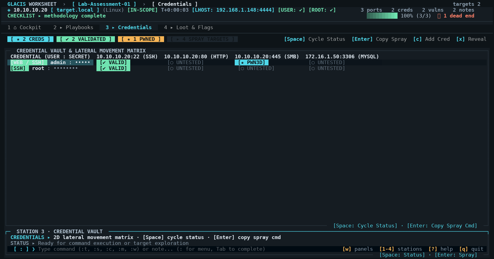
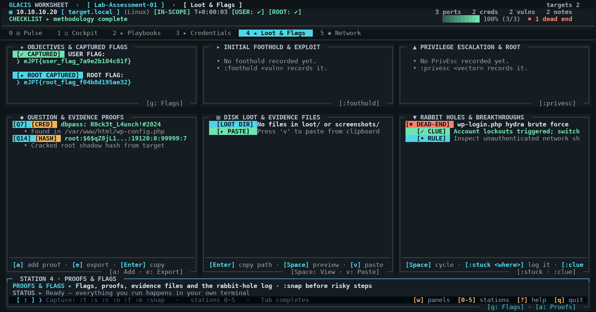
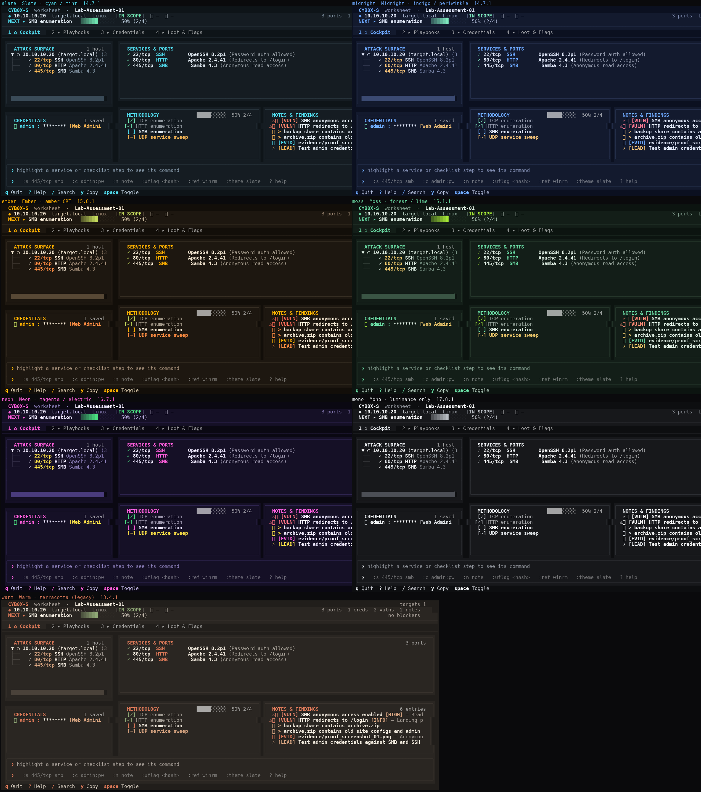

<div align="center">

```text
  ██████╗ ██╗      █████╗  ██████╗██╗███████╗
 ██╔════╝ ██║     ██╔══██╗██╔════╝██║██╔════╝
 ██║  ███╗██║     ███████║██║     ██║███████╗
 ██║   ██║██║     ██╔══██║██║     ██║╚════██║
 ╚██████╔╝███████╗██║  ██║╚██████╗██║███████║
  ╚═════╝ ╚══════╝╚═╝  ╚═╝ ╚═════╝╚═╝╚══════╝
```

### **GLACIS: Glacial Assessment & Cybersecurity Inspection Station**
*The pristine, keyboard-driven terminal field worksheet, cognitive playbook & evidence ledger.*

[](https://github.com/Mqsirrel/glacis/actions/workflows/ci.yml)
[](https://www.python.org/)
[](https://opensource.org/licenses/MIT)
[](https://textual.textualize.io/)
[-6FE3B0.svg)](#8-themes--glacial-aesthetic)
[](#3-practical-exam--certification-compliance)
[](#1-core-design-principle)

<br/>



</div>

---

**GLACIS** is an ultra-fast, keyboard-driven terminal field worksheet, cognitive methodology copilot, and structured evidence engine. Designed for penetration testers, practical certification candidates (**eJPTv2**, **eCPPT**, **OSCP**, **CPTS**, **PNPT**), and CTF competitors, GLACIS eliminates methodology amnesia, credential sprawl, and report panic under time pressure.

---

## 1. Core Design Principle

> **The human decides and performs all security-testing actions.**  
> **GLACIS records, organizes, and searches them.**

GLACIS is a local, human-controlled field notebook and methodology worksheet. It operates strictly on local SQLite storage, with zero network connections, zero external web APIs, and zero background scanners.

---

## 2. Operational Posture & Transparency

* **Default Mode: Strict Passive Recording**: Out of the box, GLACIS is a pure manual notebook. It stores only what you type, tracks your manual checklist progress, and searches your local records.
* **Offline Cognitive Playbooks**: Provides pre-compiled, static command syntax reference sheets (like a built-in `man` page or reference manual) so you never need to leave the terminal to look up common utility flags.
* **Optional Static Guidance (`derive_guidance`)**: GLACIS includes an opt-in static dictionary mapping common port numbers to standard reference commands. **This feature is OFF by default** (`GLACIS_DERIVE_GUIDANCE=0`). When disabled, no ratings or commands are inferred. When explicitly enabled by the user, it acts as a deterministic local dictionary lookup—never a live scanner, and never an autonomous decision-maker.

### What It Does
* **Organizes by Target**: Records target IPs, hostnames, OS info, and user observations.
* **Records Services**: Stores ports, protocols, service banners, and software versions manually observed.
* **Records Findings**: Stores security findings discovered during assessment, with optional human-assigned severities.
* **Manages Credentials**: Simple local vault with masked password display (`********`), explicit toggle reveal, and direct clipboard copying.
* **Tracks Methodology Checklist**: Manually toggled status (`TODO`, `CHECKED`, `DEFERRED`, `DEAD-END`) with static open-source methodology templates.
* **Captures Evidence**: Logs references and paths to screenshots, flag hashes, and command outputs without automatic collection.
* **Fast CLI Capture**: Record discoveries in sub-second CLI commands (e.g. `glacis note "..."`, `glacis cred admin:pass`).
* **Standalone Export**: Export clean, human-readable Markdown notebooks, JSON backups, or plain text summaries.
* **Fast Search**: Instant keyword search across notes, findings, services, creds, and evidence (`Ctrl+F` or `glacis search`).
* **Clipboard Integration**: Instant copying of IPs, `IP:port`, credentials, or checklist items directly to your terminal clipboard (`y` key or `Enter`).

### What It Does NOT Do
* **NO External Network Calls**: Zero external cloud APIs, zero telemetry, and zero outbound web traffic.
* **NO Autonomous Exploitation**: Never executes exploits, attacks, or payloads against target networks.
* **NO Automatic Network Scanning**: Does not execute nmap, masscan, gobuster, or any background network probes.
* **NO Multi-User Sync**: Strictly a private, single-user local SQLite database.
* **NO Automatic Vulnerability Classification**: Does not parse live banners to infer CVEs or probe targets.
* **NO Heuristic Attack Derivation**: Access-potential ratings and command recommendations are not derived by parsers. Strict scanner facts are emitted.

---

## 3. Practical Exam & Certification Compliance

Candidates frequently inquire whether GLACIS is permitted during practical certification exams like the **INE eJPT / eCPPT**, **OffSec OSCP**, **HackTheBox CPTS**, or **TCM Security PNPT**.

### How GLACIS Aligns with Certification Policies:
* **Local & Offline**: Zero cloud dependencies, zero external network traffic, and no telemetry. The posture is *machine-verifiable*: `glacis exam-check` statically parses every source file (without executing it) and fails the build if a socket, HTTP client, update check or analytics library is imported anywhere.
* **Local Snapshots, Local Exports**: Database snapshots (`glacis snapshot …` / `:snap`) and HTML handovers are plain local files; the HTML export inlines its CSS and references **no** external URLs, scripts or fonts.
* **Personal Worksheet Model**: Practical exams permit candidates to maintain their own notes, command references, and methodology checklists. GLACIS is simply a fast terminal-based alternative to Obsidian, CherryTree, or a local markdown file.
* **Human-in-the-Loop**: All commands must be executed manually by the candidate in their own terminal. GLACIS does not execute commands on your behalf.
* **Zero Unauthorized Assistance**: Does not communicate with outside parties, mentors, or generative AI models.
* **Zero Compromised Content**: Does not ship with or reference any actual exam machines, answers, past-attempt data, or walkthroughs.

> [!NOTE]
> **No Need to Cripple the Tool**: Compliance does not require disabling the core TUI, offline playbooks, or checklist features. As long as you maintain the exam-safe posture (keeping `derive_guidance` in its default `OFF` state and avoiding storing prohibited or NDA exam content), GLACIS functions strictly as an individual candidate's electronic field journal.
>
> *Always consult the specific, current guidelines of your certification authority (INE, OffSec, etc.) prior to starting your exam session.*

---

## 4. Methodology & Playbook Provenance

All pre-loaded checklist templates (`ejpt`, `discovery`, `web`, `smb`, `pivoting`, `privesc`) and command reference sheets ship with full source transparency:

* **Open-Source & Public Standards**: Sourced exclusively from widely published, publicly available industry methodologies:
  * **PTES (Penetration Testing Execution Standard)**
  * **OWASP Web Security Testing Guide (WSTG v4.2)**
  * **NIST SP 800-115** (Technical Guide to Information Security Testing and Assessment)
  * **Public Community Repositories**: GTFOBins, LOLBAS, PayloadsAllTheThings, and standard Linux/BSD/Windows manual pages.
* **Strictly Non-Compromised**:
  * **Zero proprietary exam questions or slides** from any commercial vendor.
  * **Zero previous-attempt artifacts**, specific exam flag patterns, or target walkthroughs.
  * **Generic educational syntax only**: Commands use generic placeholders (`<TARGET_IP>`, `<TARGET_SUBNET>`, `<PORTS>`).

---

## 5. Dual-Terminal Workflow (tmux / Split Screen)

GLACIS is engineered as a zero-friction terminal companion running side-by-side with your active shell. The recommended workflow is a 50/50 horizontal or vertical terminal split (or `tmux` session):

```
┌─────────────────────────────────────────┬─────────────────────────────────────────┐
│ TERMINAL 1: ACTIVE TOOLS & SHELL        │ TERMINAL 2: GLACIS COCKPIT & WORKSHEET  │
│                                         │                                         │
│ $ nmap -sC -sV -p 22,80,445 10.10.10.20 │ ┌─ GLACIS  worksheet · Lab-01 ────────┐ │
│ PORT    STATE SERVICE     VERSION       │ │ ◆ 10.10.10.20  target.local  Linux  │ │
│ 22/tcp  open  ssh         OpenSSH 8.2p1 │ │ 1 ⌂ Cockpit  2 ▸ Books  3 ▸ Creds   │ │
│ 80/tcp  open  http        Apache 2.4.41 │ ├─────────────────────────────────────┤ │
│ 445/tcp open  smb         Samba 4.3     │ │ ❯ smbmap -H 10.10.10.20 [Enter]=copy│ │
│                                         │ └─────────────────────────────────────┘ │
│                                         │                                         │
│ # Press [Enter] on GLACIS recommendation│ 1. Record targets & services (`s`)      │
│ # Syntax is already copied to clipboard!│ 2. Advance methodology checklist (`Spc`)│
│ $ smbmap -H 10.10.10.20 -u guest -p ''  │ 3. Store credentials securely (`c`)     │
│ [+] Guest access enabled on \backup     │ 4. Track flags, loot & proofs (`g`)     │
│                                         │ 5. Global instant search (`Ctrl+F`)     │
└─────────────────────────────────────────┴─────────────────────────────────────────┘
```

### The Seamless Friction-Free Cycle
1. **Explore (Terminal 1)**: Run your port scans, web fuzzers, and scripts in your active shell.
2. **Record (Terminal 2)**: Add newly found ports, notes, and credentials directly into GLACIS via rapid hotkeys (`s`, `n`, `c`, `f`) or the bottom command bar (`:s 445/tcp smb`).
3. **Bridge via Clipboard**: Highlight any service or guidance item in GLACIS and press **`Enter`** or **`y`**. GLACIS formats the exact command with target IPs and ports filled in and sends it straight to your clipboard—ready to paste into Terminal 1.
4. **Export at Submission Time**: One command (`glacis export -f md -o report.md`) generates a pristine, publication-grade Markdown field report ready for exam grading or client delivery.

---

## 6. Installation & Quickstart

```bash
# Clone the official repository
git clone https://github.com/Mqsirrel/glacis.git
cd glacis

# Install locally with uv (recommended) or pip
uv pip install -e .
# or
pip install -e .
```

### Launch GLACIS

```bash
# Launch interactive TUI in current folder
glacis
# Shorthand alias:
gls

# Or initialize an isolated lab workspace
glacis init my-lab && cd my-lab
glacis
```

---

## 7. Fast Capture CLI

The CLI is engineered for minimal friction. It records verbatim what you supply:

### Record a Target
```bash
glacis target 10.10.10.20 --hostname target.local --os Linux
# Shorthand alias:
glacis t 10.10.10.20
```

### Record a Service
```bash
glacis service 10.10.10.20 22/tcp SSH --version "OpenSSH 8.2p1"
glacis service 10.10.10.20 80/tcp HTTP --version "Apache 2.4.41"
glacis service 10.10.10.20 445/tcp SMB --version "Samba 4.3"
# Shorthand alias:
glacis s 445/tcp SMB
```

### Record a Field Note
```bash
glacis note "Port 80 redirects to /login"
# Shorthand alias:
glacis n "backup share contains archive.zip"
```

### Record a Manually Discovered Finding
```bash
glacis finding "SMB anonymous access enabled" --notes "read access to backup share" --severity HIGH
# Shorthand alias:
glacis f "HTTP default credentials on tomcat manager"
```

### Record a Credential
```bash
glacis cred admin:secret123 --source "backup.zip" --scope "SMB"
# Shorthand alias:
glacis c user:Summer2024!
```

### Manage Checklists & Ready Methodology Templates
GLACIS includes ready-to-use, standard penetration testing methodology templates (PTES, OWASP, NIST standard). These are 100% static cognitive safety nets and memory aids.

| Template | Focus Area | Items | Description |
|---|---|---|---|
| `ejpt` | Master Workflow | 14 | Full practical assessment flow (Scope → Discovery → Foothold → Pivoting → PrivEsc) |
| `discovery` | Network Discovery | 7 | Local subnets, ARP scans, ICMP sweeps, TTL OS guesses, dual-homed machine discovery |
| `pivoting` | Pivoting & Routing | 13 | Dual-homed detection, Metasploit autoroute, SOCKS5 proxy, SSH tunnels, Chisel, Proxychains |
| `web` | Web Applications | 14 | Headers, robots.txt, directory fuzzing, SQLi, LFI, XSS, Command Injection, uploads |
| `smb` | SMB & Shares | 9 | Null sessions, share permissions, backups/configs, enum4linux, RID cycling |
| `ftp` | FTP Services | 8 | Anonymous login, banner CVEs, binary mode, writable folders, web shell uploads |
| `ssh` | SSH Services | 7 | OpenSSH banner CVEs, key permissions, root login, discovered credential spraying |
| `snmp` | SNMP (UDP 161) | 9 | Community strings, MIB walk, running processes, installed software, interfaces |
| `databases` | Databases (MySQL/MSSQL)| 9 | Blank root logins, table dumping, MySQL `LOAD_FILE`, MSSQL `xp_cmdshell` |
| `linux` | Linux PrivEsc | 14 | SUID/SGID, `sudo -l`, cron jobs, capabilities, writable passwd, shadow leaks |
| `windows` | Windows PrivEsc | 14 | `whoami /priv` (SeImpersonate), unquoted paths, AlwaysInstallElevated, scheduled tasks |
| `cracking` | Password Cracking | 9 | Hash identification, John the Ripper, Hashcat modes, Hydra online brute-forcing |

```bash
# Apply eJPT master methodology to active target:
glacis checklist template ejpt

# Apply pivoting checklist for an internal host:
glacis checklist template pivoting

# Check off an item:
glacis checklist check "Directory and file fuzzing"

# List current checklist items:
glacis checklist list
```

*(In the TUI, press **`m`** to open the interactive template picker)*

### Offline Command Reference & Methodology Playbook
Instant, offline playbook lookup with dynamic target IP substitution:

```bash
# Lookup WinRM commands for active target:
glacis ref winrm

# Lookup SMB commands and copy top syntax to clipboard:
glacis ref smb --copy

# Lookup PrivEsc, Pivoting, or Database commands:
glacis ref privesc
glacis ref mssql
glacis ref mimikatz
```

*(In the TUI, press **`r`** or type `:ref <keyword>` to open the interactive Command Reference modal)*

### Search Across Everything
```bash
glacis search "backup"
```

### Export Notes & Deliverables
```bash
# Clean standalone Markdown notebook:
glacis export --format md -o notes.md

# Self-contained printable HTML handover (embedded CSS, zero external URLs):
glacis export --format html -o report.html

# Full lossless JSON backup:
glacis export --format json -o workspace_backup.json

# Plain text:
glacis export --format txt
```

### Pulse Triage (deterministic, explainable)
```bash
# Host kill-chain phases + state-gap advisories (S1–S8), computed from
# your own records. No heuristics in the cloud, nothing ever runs.
glacis triage

# Add --direction for the opt-in focus-shift hints (D1–D4), such as
# credential-reuse surfaces or rabbit-hole switches. Off by default.
glacis triage --direction
```

### Snapshot Safety Net
Before a destructive bulk action (e.g. scan import), rotate a consistent
online backup of the SQLite database. Newest 5 are kept by default.
```bash
glacis snapshot create -n "before scan import"
glacis snapshot list
glacis snapshot restore 1 --yes     # 1 = newest; a pre-restore snapshot is taken automatically
```
Inside the TUI: `:snap [note]`. Scan imports trigger an automatic snapshot.

### Offline Compliance Proof
```bash
glacis exam-check      # static AST scan of the package: exits 1 on any network/telemetry import
```

### Documented Pivots
```bash
glacis pivot 10.10.10.20 "192.168.50.0/24 via socks5:1080"
glacis route 192.168.50.10          # renders hop chain + ProxyChains/Chisel/SSH-Jump syntax
glacis pivot 10.10.10.20 --unmark
```
The TUI equivalent is `:pivot <route note>`; open Station **`5`** for the
topology map and copy-ready tunnel actions.

---

## 8. Terminal User Interface (TUI) Architecture

GLACIS features **6 dedicated mission stations** accessible via digits
**`0`**–**`5`**. The code is split into a `tui/stations/` package
(station-level screens) and a `tui/widgets/` package (reusable panels,
lists and modals), each staying well under the size of the former monolith.

```text
┌─ GLACIS · station architecture ─────────────────────────────────────────────┐
│ 0 ◎ Pulse       situation board: host phases, transparent progress, signals │
│ 1 ⌂ Cockpit     surface tree · services · methodology · notes (one screen)  │
│ 2 ▸ Playbooks   offline command reference (Enter copies)                    │
│ 3 ▸ Credentials vault + spray matrix                                        │
│ 4 ★ Loot        flags, proofs, foothold ledger, rabbit holes                │
│ 5 ◈ Network      documented subnets, pivots, SOCKS/ProxyChains actions      │
└─────────────────────────────────────────────────────────────────────────────┘
```

Lists reconcile **differentially**: rows are matched by stable model keys, so
adding or editing a record never clears the list — scroll position, cursor and
focus survive every refresh (a hard requirement during timed exams).

### Station 0: Pulse (`0`)

A deterministic situation-awareness board recomputed purely from recorded
data. The left panel shows one row per host — its kill-chain phase,
transparent progress arithmetic (`recon → foothold → user → root → complete`)
and dead-end heat. The right panel lists **explainable advisories**: every
signal carries a stable rule id (`S1`–`S8` state rules always visible;
`D1`–`D4` focus-shift rules only after pressing **`G`**, mirroring the
opt-in derived-guidance posture). Enter on a host focuses it in the Cockpit;
Enter on an advisory jumps to the station that owns the gap. No timers, no
background work, no network — the report is pure arithmetic over your notes.

```text
┌ OVERALL 27.5%  RECON 1  FOOTHOLD 1 │ svc 4 creds 1 proofs 0 dead 0 ┐ ┌ STATE ONLY ┐
┌─ HOST TRIAGE BOARD ───────────────┐ ┌─ EXPLAINABLE NEXT-FOCUS SIGNALS ─────────┐
│ ▸ 10.10.10.20 web01 ███░░░░░ 40%  │ │ ▲ [S6-foothold-no-golden] foothold saved  │
│   [FOOTHOLD] s3 k1 ⇄              │ │   without a golden reproduction command   │
│ ◐ 192.168.50.10 db  █░░░░░░░ 15%  │ │ · [S3-checklist-next] next: SMB enum (0/2)│
│   [RECON] s1                      │ │ • [D1-cred-reuse] 'admin' untried on :22  │
└───────────────────────────────────┘ │   (opt-in focus hints — press G)          │
                                      └───────────────────────────────────────────┘
```

### Station 1: The Cockpit (`1`)

```text
┌─ GLACIS  worksheet · Lab-01 ───────────────────────────────────── targets 1 ─┐
│ ◆ 10.10.10.20  target.local  Linux   [IN-SCOPE]  🏁 —  👑 —   3 ports 1 cred   │
│ NEXT ▸ SMB null session check   ██████░░░░  50% (2/4)              no blockers │
│  1 ⌂ Cockpit    2 ▸ Playbooks    3 ▸ Credentials    4 ▸ Loot & Flags          │
├──────────────────┬────────────────────────────────────────────────────────────┤
│ ATTACK SURFACE   │ SERVICES & PORTS                                  3 ports  │
│ ▾ 10.10.10.20    │  22/tcp   ssh     OpenSSH 8.2p1   ▸ hydra -l …             │
│   22 ssh         │  80/tcp   http    Apache 2.4.41   ▸ feroxbuster …          │
│   445 smb        │  445/tcp  smb     Samba 4.3       ▸ smbmap -H …            │
│                  ├────────────────────────────┬───────────────────────────────┤
│ CREDENTIALS      │ METHODOLOGY    ████░░ 50%  │ NOTES & FINDINGS     6 entries│
│ 🔑 admin : ••••  │ ✓ TCP enumeration          │ ⚠ SMB anonymous access [HIGH]│
├──────────────────┴────────────────────────────┴───────────────────────────────┤
│ ❯ smbmap -H 10.10.10.20 -u guest -p ''                        [Enter]=copy    │
│   Null session lists shares without auth — check every share for backups.     │
│ ▸ :s 445/tcp smb   :c admin:pw   :n note   :uflag <hash>   :ref winrm   ? help │
└───────────────────────────────────────────────────────────────────────────────┘
```

Station 1 answers the four questions you keep asking under time pressure:

| Zone | Mission Question |
|---|---|
| **Status Strip** | Which box am I on, and what have I captured? |
| **`NEXT ▸` Row** | What is my current checklist milestone, and how far through the methodology am I? |
| **Services Panel** | What is exposed on the target? |
| **Bottom Console** | What syntax can I copy right now — and where do I type new findings? |

### Station 2: Cognitive Playbooks (`2`)

Full-screen offline methodology playbooks, service inspection flows, and command reference cheatsheets for common services (SSH, SMB, HTTP, MySQL, MSSQL, SNMP, WinRM, RDP, PrivEsc, Pivoting, etc.).

<p align="center">
  
</p>

### Station 3: Credential Matrix & Spray Tracker (`3`)

Multi-target credential vault and 2D spray matrix tracking `username:password` pairs across target services (SSH, SMB, HTTP, DB, WinRM) with masked values and fast clipboard copying.

<p align="center">
  
</p>

### Station 4: Loot, Flags & Exam Proofs (`4`)

Structured ledger for user flags, root flags, exam question proofs, loot paths, and the negative-knowledge rabbit hole failure log to avoid repeating dead ends.

<p align="center">
  
</p>

### Station 5: Network (`5`)

A passive map of the subnets and pivots **you documented**, plus copy-ready
tunnel syntax (ProxyChains config, Chisel server/client, SSH ProxyJump, SOCKS
dynamic forwarding, proxied TCP scan hint). GLACIS never pings or traces a
route; the topology math is derived solely from target IPs and your
`:pivot` notes, and every action is copied for you to run in your own
terminal.

```text
┌─ DOCUMENTED NETWORK TOPOLOGY ─────┐ ┌─ TUNNEL & ROUTE ACTIONS ───────────────┐
│ === NETWORK TOPOLOGY: LAB-01 ===  │ │ ProxyChains config — all documented hops│
│ ┌─ Subnet: 10.10.10.0/24          │ │   strict_chain / socks5 127.0.0.1 1080  │
│ │  • 10.10.10.20 (web01) [⇄ PIV]  │ │ Chisel server (attacker host)          │
│ ┌─ Subnet: 192.168.50.0/24        │ │   ❯ chisel server -p 8000 --reverse     │
│ │  • 192.168.50.10 (db)           │ │ Chisel client via 10.10.10.20 → /24    │
│                                   │ │ SSH ProxyJump to 192.168.50.10 [Enter]  │
└───────────────────────────────────┘ └─────────────────────────────────────────┘
```

---

## 9. Themes & Glacial Aesthetic

GLACIS ships with **8 carefully crafted palettes** engineered for long-session ergonomics and crystal-clear typography. Every palette strictly maintains **WCAG AAA** contrast (≥7:1) for body text and **WCAG AA** (≥4.5:1) for muted auxiliary text.

| Name | Aesthetic | Style Description | Command |
|---|---|---|---|
| `slate` *(default)* | ❄️ **Glacial Cyan / Frost Mint** | Deep arctic graphite chrome with crisp cyan and mint data tokens. | `:theme slate` |
| `midnight` | 🌌 Indigo / Periwinkle | Calm, deep nocturnal palette with minimal ocular flare. | `:theme midnight` |
| `ember` | 📟 Amber CRT | Warm monochrome phosphor glow evoking classic terminals. | `:theme ember` |
| `cyber` | ⚡ Tokyo Electric | Electric cyan and vivid neon accents for high visual contrast. | `:theme cyber` |
| `sugary` | ☕ Vanilla Cream / Latte | Warm light mode with espresso typography and pastry tones. | `:theme sugary` |
| `candy` | 🍬 Cotton Lilac / Glaze | Soft pastel background with rich berry and violet highlights. | `:theme candy` |
| `caramel` | 🍯 Toffee / Maple Sugar | Warm parchment with rich honey and roasted caramel tones. | `:theme caramel` |
| `catppuccin` | 🍧 Mocha / Sapphire | The beloved soothing pastel theme with cool sapphire accents. | `:theme catppuccin` |

* **Interactive Theme Picker**: Press **`T`** anywhere in the Cockpit (`↑`/`↓` or `j`/`k` for live full-screen preview, `1-8` for instant pick, `d` to set as persistent default, `Enter` to keep, `Esc` to cancel).
* **Aliases**: `:theme glacier`, `:theme frost`, and `:theme ice` are instant aliases for the default `slate` palette.

To render and preview every palette simultaneously:

```bash
python dev/theme_gallery.py    # writes dev/previews/theme-gallery.png
```

<p align="center">
  
</p>

---

## 10. TUI Keyboard Shortcuts Matrix

| Key | Action | Scope |
|---|---|---|
| `0` | **Pulse Station** — host triage board & explainable next-focus signals | Global |
| `1` | **Cockpit Station** — attack surface, services, methodology, notes | Global |
| `2` | **Playbooks Station** — full-screen interactive playbook browser | Global |
| `3` | **Credentials Station** — credential vault & service spray matrix | Global |
| `4` | **Loot & Flags Station** — flags, foothold proof, rabbit-hole log | Global |
| `5` | **Network Station** — documented subnets, pivots & tunnel actions | Global |
| `Tab` / `Shift+Tab` | Cycle focus between visible panels | Cockpit |
| `j` / `k` (or `↑` / `↓`) | Move down / up inside active list or tree | Lists |
| `Enter` | **Copy command** from bottom runner to clipboard | Focused item |
| `y` | Copy raw value (IP, `IP:port`, credential, note text) | Focused item |
| `Space` | Cycle status (`TODO` → `CHECKED` → `DEFERRED` → `DEAD-END`) or unmask password | Items |
| `z` | Zoom focused panel to fill entire screen (press again to restore) | Cockpit |
| `g` | Record captured flags (`user.txt`, `root.txt`) | Global |
| `r` | Quick command reference popup modal | Global |
| `o` | Toggle target in-scope / out-of-scope | Target |
| `/` or `Ctrl+F` | Global real-time fuzzy search modal | Global |
| `t` | Add target modal | Global |
| `s` | Add service modal | Global |
| `f` | Add finding modal | Global |
| `c` | Add credential modal | Global |
| `n` | Add field note modal | Global |
| `K` (`Shift+k`) | Add custom checklist item | Cockpit |
| `m` | Methodology template picker modal | Cockpit |
| `d` | Delete highlighted item (with safety confirmation) | Lists |
| `T` | Open theme picker modal with live preview | Global |
| `G` | Toggle derived guidance (Pulse `D1`–`D4` focus-shift hints); **off by default** | Global |
| `?` | Interactive help and cheat sheet | Global |
| `q` | Exit GLACIS | Global |

---

## 11. Quick Command Bar (Bottom of TUI)

Type directly into the bottom console input to execute rapid actions:

* `:0` … `:5` — Instant station switching (or `:pulse` / `:network`)
* `:t <ip>` — Quick target addition
* `:s <port/proto> <service>` — Quick service addition (e.g. `:s 445/tcp smb`)
* `:c <user:pass>` — Quick credential addition
* `:n <text>` — Quick field note
* `:f <text>` — Quick finding
* `:uflag <hash>` / `:rflag <hash>` — Save captured exam flags
* `:foothold <vuln>` — Record initial access foothold
* `:privesc <vector>` — Record privilege escalation vector
* `:pivot <route>` — Mark active host dual-homed (e.g. `:pivot 192.168.1.0/24 via socks5:1080`); `:pivot off` clears
* `:snap [note]` — Snapshot the notebook database (newest 5 kept; auto-runs before scan imports)
* `:stuck <why>` — Log a rabbit hole dead end
* `:clue <breakthrough>` — Log the breakthrough clue that unlocked progress
* `:ev <path>` — Log evidence file path
* `:ref <term>` — Pop up offline command reference (e.g. `:ref winrm`)
* `:export exam` — Write the exam evidence bundle (`exam_evidence.md`)
* `:export html [file]` — Write a self-contained, printable HTML handover
* `:theme <name>` — Switch palette (`slate`, `midnight`, `ember`, `cyber`, `sugary`, `candy`, `caramel`, `catppuccin`); `:theme` alone cycles
* `:q` — Quit

*Anything else typed into the command bar without a `:` prefix is automatically recorded as a field note.*

---

## 12. License & Community

Distributed under the **MIT License**. Built for ethical security professionals, lab students, and penetration testers who value speed, simplicity, and strict methodology discipline.
