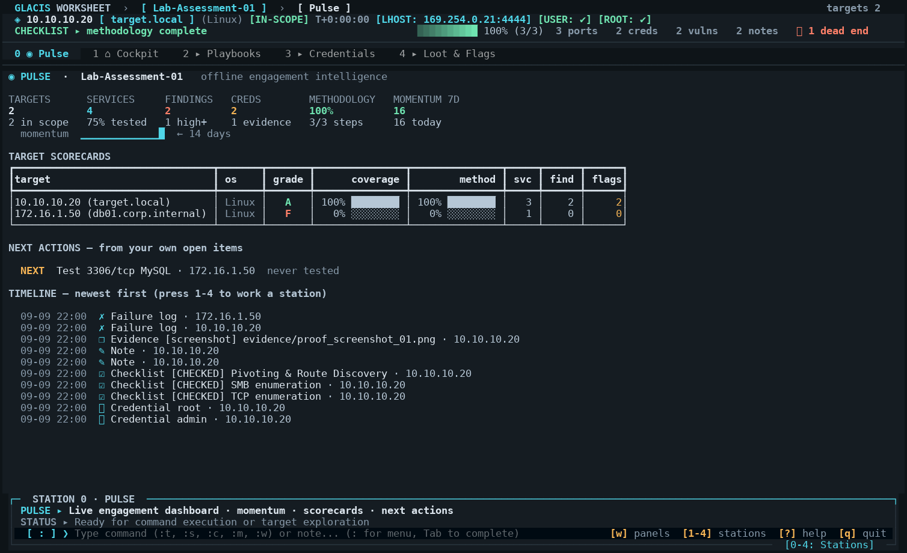

# GLACIS — FIELD WORKSHEET

**Local, human-controlled terminal field worksheet and offline methodology companion.**

```
┌─────────────────────────────────────────────────────────────┐
│ GLACIS WORKSHEET                    MODE: MANUAL           │
│ Local field notebook                 Human-controlled       │
└─────────────────────────────────────────────────────────────┘
```

GLACIS provides a fast, keyboard-driven terminal field worksheet for recording, structuring, and searching information discovered during cybersecurity labs, CTFs, and practical assessments.

---

## 1. Core Design Principle

> **The human decides and performs all security-testing actions.**  
> **GLACIS records, organizes, and searches them.**

GLACIS is a local, human-controlled field notebook and methodology worksheet. It operates strictly on local SQLite storage, with zero network connections, zero external web APIs, and zero background scanners.

> [!NOTE]
> **AI-Assisted Release**: version 0.2.0 ("Pulse") was planned, designed and
> implemented with the help of **GPT-6 Astra (medium)** via Arena.ai's Agent
> Mode, then validated by the project's test suite (212 tests). The tool's
> guarantees — offline-only, passive, human-controlled — were treated as hard
> constraints throughout and are unchanged.

---

## 2. Operational Posture & Transparency

To maintain total transparency:
* **Default Mode: Strict Passive Recording**: Out of the box, GLACIS is a pure manual notebook. It stores only what you type, tracks your manual checklist progress, and searches your local records.
* **Offline Cognitive Playbooks**: Provides pre-compiled, static command syntax reference sheets (like a built-in `man` page or reference manual) so you never need to leave the terminal to look up common utility flags.
* **Optional Static Guidance (`derive_guidance`)**: GLACIS includes an opt-in static dictionary mapping common port numbers to standard reference commands. **This feature is OFF by default** (`GLACIS_DERIVE_GUIDANCE=0`). When disabled, no ratings or commands are inferred. When explicitly enabled by the user, it acts as a deterministic local dictionary lookup—never a live scanner, and never an autonomous decision-maker.

### What It Does
* **Organizes by Target**: Records target IPs, hostnames, OS info, and user observations.
* **Records Services**: Stores ports, protocols, service banners, and software versions manually observed.
* **Records Findings**: Stores security findings discovered during assessment, with optional human-assigned severities.
* **Manages Credentials**: Simple local vault with masked password display (`********`), explicit toggle reveal, and direct clipboard copying.
* **Tracks Methodology Checklist**: Manually toggled status (`TODO`, `CHECKED`, `DEFERRED`, `DEAD-END`) with static open-source methodology templates.
* **Captures Evidence**: Logs references and paths to screenshots, flag hashes, and command outputs without automatic collection.
* **Fast CLI Capture**: Record discoveries in sub-second CLI commands (e.g. `glacis note "..."`, `glacis cred admin:pass`).
* **Standalone Export**: Export clean, human-readable Markdown notebooks, lossless JSON backups, plain text summaries — or a gorgeous **standalone HTML report** that renders anywhere, fully offline.
* **Pulse Dashboard**: A live engagement dashboard (momentum sparkline, per-target scorecards with A–F grades, next-action triage queue, unified timeline) — pure read-only math over your own records, still 100% offline.
* **Snapshot Safety Net**: `glacis backup` takes timestamped JSON snapshots with automatic rotation; restore never overwrites existing data.
* **Fast Search**: Instant keyword search across notes, findings, services, creds, and evidence (`Ctrl+F` or `glacis search`).
* **Clipboard Integration**: Instant copying of IPs, `IP:port`, credentials, or checklist items directly to your terminal clipboard (`y` key).

### What It Does NOT Do
* **NO External Network Calls**: Zero external cloud APIs, zero telemetry, and zero outbound web traffic.
* **NO Autonomous Exploitation**: Never executes exploits, attacks, or payloads against target networks.
* **NO Automatic Network Scanning**: Does not execute nmap, masscan, gobuster, or any background network probes.
* **NO Multi-User Sync**: Strictly a private, single-user local SQLite database.
* **NO Automatic Vulnerability Classification**: Does not parse live banners to infer CVEs or probe targets.
* **NO Heuristic Attack Derivation**: Access-potential ratings and command recommendations are not derived by parsers. Strict scanner facts are emitted.
* **NO Guesswork In Pulse Either**: The Pulse dashboard and triage queue only count, sort, and timestamp what *you* recorded. Grades measure *your progress*, never a target's vulnerability.

---

## 3. Practical Exam & Certification Compliance (e.g., INE / eJPT)

Candidates often ask whether GLACIS is permitted during practical certification exams like the INE eJPT, eWPT, or similar hands-on assessments.

### How GLACIS Aligns with Certification Policies:
* **Local & Offline**: Zero cloud dependencies, zero external network traffic, and no telemetry.
* **Personal Worksheet Model**: Practical exams permit candidates to maintain their own notes, command references, and methodology checklists. GLACIS is simply a fast terminal-based alternative to Obsidian, CherryTree, or a local markdown file.
* **Human-in-the-Loop**: All commands must be executed manually by the candidate in their own terminal. GLACIS does not execute commands on your behalf.
* **Zero Unauthorized Assistance**: Does not communicate with outside parties, mentors, or generative AI models.
* **Zero Compromised Content**: Does not ship with or reference any actual exam machines, answers, past-attempt data, or walkthroughs.

> [!NOTE]
> **No Need to Cripple the Tool**: Compliance does not require disabling the core TUI, offline playbooks, or checklist features. As long as you maintain the exam-safe posture (keeping `derive_guidance` in its default `OFF` state and avoiding storing prohibited or NDA exam content), GLACIS functions strictly as an individual candidate's electronic field journal.
>
> *Always consult the specific, current guidelines of your certification authority (INE, OffSec, etc.) prior to starting your exam session.*

---

## 4. Methodology & Playbook Provenance

All pre-loaded checklist templates (`ejpt`, `discovery`, `web`, `smb`, `pivoting`, `privesc`) and command reference sheets ship with full source transparency:

* **Open-Source & Public Standards**: Sourced exclusively from widely published, publicly available industry methodologies:
  * **PTES (Penetration Testing Execution Standard)**
  * **OWASP Web Security Testing Guide (WSTG v4.2)**
  * **NIST SP 800-115** (Technical Guide to Information Security Testing and Assessment)
  * **Public Community Repositories**: GTFOBins, LOLBAS, PayloadsAllTheThings, and standard Linux/BSD/Windows manual pages.
* **Strictly Non-Compromised**:
  * **Zero proprietary exam questions or slides** from any commercial vendor.
  * **Zero previous-attempt artifacts**, specific exam flag patterns, or target walkthroughs.
  * **Generic educational syntax only**: Commands use generic placeholders (`<TARGET_IP>`, `<TARGET_SUBNET>`, `<PORTS>`).

---

## 4. Example Workflow

```
Run your tools yourself (nmap, burp, terminal)
               ↓
     Discover something
               ↓
    Record it in GLACIS
               ↓
       Continue working
               ↓
     Update findings/evidence
               ↓
       Export your notes
```

---

## 5. Installation

```bash
# Clone the repository
git clone https://github.com/your-org/glacis.git
cd glacis

# Install locally with pip or uv
pip install -e .
# or
uv pip install -e .
```

---

## 6. Fast Capture CLI

The CLI is engineered for minimal friction. It records verbatim what you supply:

### Record a Target
```bash
glacis target 10.10.10.20 --hostname target.local --os Linux
# Shorthand alias:
glacis t 10.10.10.20
```

### Record a Service
```bash
glacis service 10.10.10.20 22/tcp SSH --version "OpenSSH 8.2p1"
glacis service 10.10.10.20 80/tcp HTTP --version "Apache 2.4.41"
glacis service 10.10.10.20 445/tcp SMB --version "Samba 4.3"
# Shorthand alias:
glacis s 445/tcp SMB
```

### Record a Field Note
```bash
glacis note "Port 80 redirects to /login"
# Shorthand alias:
glacis n "backup share contains archive.zip"
```

### Record a Manually Discovered Finding
```bash
glacis finding "SMB anonymous access enabled" --notes "read access to backup share" --severity HIGH
# Shorthand alias:
glacis f "HTTP default credentials on tomcat manager"
```

### Record a Credential
```bash
glacis cred admin:secret123 --source "backup.zip" --scope "SMB"
# Shorthand alias:
glacis c user:Summer2024!
```

### Manage Checklists & Ready Methodology Templates
GLACIS includes ready-to-use, standard penetration testing methodology templates (PTES, OWASP, NIST standard). These are 100% static cognitive safety nets and memory aids.

| Template | Focus Area | Items | Description |
|---|---|---|---|
| `ejpt` | Master Workflow | 14 | Full practical assessment flow (Scope → Discovery → Foothold → Pivoting → PrivEsc) |
| `discovery` | Network Discovery | 7 | Local subnets, ARP scans, ICMP sweeps, TTL OS guesses, dual-homed machine discovery |
| `pivoting` | Pivoting & Routing | 13 | Dual-homed detection, Metasploit autoroute, SOCKS5 proxy, SSH tunnels, Chisel, Proxychains |
| `web` | Web Applications | 14 | Headers, robots.txt, directory fuzzing, SQLi, LFI, XSS, Command Injection, uploads |
| `smb` | SMB & Shares | 9 | Null sessions, share permissions, backups/configs, enum4linux, RID cycling |
| `ftp` | FTP Services | 8 | Anonymous login, banner CVEs, binary mode, writable folders, web shell uploads |
| `ssh` | SSH Services | 7 | OpenSSH banner CVEs, key permissions, root login, discovered credential spraying |
| `snmp` | SNMP (UDP 161) | 9 | Community strings, MIB walk, running processes, installed software, interfaces |
| `databases` | Databases (MySQL/MSSQL)| 9 | Blank root logins, table dumping, MySQL `LOAD_FILE`, MSSQL `xp_cmdshell` |
| `linux` | Linux PrivEsc | 14 | SUID/SGID, `sudo -l`, cron jobs, capabilities, writable passwd, shadow leaks |
| `windows` | Windows PrivEsc | 14 | `whoami /priv` (SeImpersonate), unquoted paths, AlwaysInstallElevated, scheduled tasks |
| `cracking` | Password Cracking | 9 | Hash identification, John the Ripper, Hashcat modes, Hydra online brute-forcing |

```bash
# Apply eJPT master methodology to active target:
glacis checklist template ejpt

# Apply pivoting checklist for an internal host:
glacis checklist template pivoting

# Check off an item:
glacis checklist check "Directory and file fuzzing"

# List current checklist items:
glacis checklist list
```

*(In the TUI, press **`m`** to open the interactive template picker)*

### Offline Command Reference & Methodology Playbook
Instant, offline playbook lookup with dynamic target IP substitution:

```bash
# Lookup WinRM commands for active target:
glacis ref winrm

# Lookup SMB commands and copy top syntax to clipboard:
glacis ref smb --copy

# Lookup PrivEsc, Pivoting, or Database commands:
glacis ref privesc
glacis ref mssql
glacis ref mimikatz
```

*(In the TUI, press **`r`** or type `:ref <keyword>` to open the interactive Command Reference modal)*

### Search Across Everything
```bash
glacis search "backup"
```

### Export Notes & Reports
```bash
# Clean standalone Markdown notebook:
glacis export --format md -o notes.md

# Full lossless JSON backup:
glacis export --format json -o workspace_backup.json

# Plain text:
glacis export --format txt

# Gorgeous self-contained HTML report (zero external assets, print-ready):
glacis export --format html -o report.html          # creds masked
glacis export --format html -o report.html --reveal-creds
glacis export --format html -o report.html --palette ember
```

### Pulse — Offline Engagement Intelligence

```bash
# Headline stats, target scorecards, next-action triage:
glacis stats

# Unified chronological journal of everything recorded:
glacis timeline --limit 40

# Snapshot safety net:
glacis backup --label pre-enum     # timestamped JSON snapshot (auto-rotates, keeps 20)
glacis backups                     # list snapshots
glacis restore <snapshot.json>     # restores as a NEW workspace — never overwrites
```

Pulse is strictly read-only arithmetic over records you captured: coverage
percentages, momentum, grades and a triage queue assembled from your own open
items. Same offline, deterministic, human-controlled posture as the rest of
GLACIS — it never probes, infers risk, or suggests exploits.

---

## 7. Terminal User Interface (TUI)

Launch the interactive field worksheet by running:

```bash
glacis
# or
glacis tui
```

The five stations:

| Station | Key | Purpose |
|---|---|---|
| **0 ◉ Pulse** | `0` | Live dashboard: momentum sparkline, scorecards, next actions, timeline |
| **1 ⌂ Cockpit** | `1` | Attack surface, services, methodology, notes — one screen |
| **2 ▸ Playbooks** | `2` | Offline command reference browser |
| **3 ▸ Credentials** | `3` | Full credential vault & spray matrix |
| **4 ▸ Loot & Flags** | `4` | User/root flags, foothold proof, rabbit-hole log |



### The cockpit (station 1)

```
┌─ GLACIS  worksheet · Lab-01 ───────────────────────────────────── targets 1 ─┐
│ ◆ 10.10.10.20  target.local  Linux   [IN-SCOPE]  🏁 —  👑 —   3 ports 1 cred   │
│ NEXT ▸ SMB null session check   ██████░░░░  50% (2/4)              no blockers │
│  1 ⌂ Cockpit    2 ▸ Playbooks    3 ▸ Credentials    4 ▸ Loot & Flags          │
├──────────────────┬────────────────────────────────────────────────────────────┤
│ ATTACK SURFACE   │ SERVICES & PORTS                                  3 ports  │
│ ▾ 10.10.10.20    │  22/tcp   ssh     OpenSSH 8.2p1   ▸ hydra -l …             │
│   22 ssh         │  80/tcp   http    Apache 2.4.41   ▸ feroxbuster …          │
│   445 smb        │  445/tcp  smb     Samba 4.3       ▸ smbmap -H …            │
│                  ├────────────────────────────┬───────────────────────────────┤
│ CREDENTIALS      │ METHODOLOGY    ████░░ 50%  │ NOTES & FINDINGS     6 entries│
│ 🔑 admin : ••••  │ ✓ TCP enumeration          │ ⚠ SMB anonymous access [HIGH]│
├──────────────────┴────────────────────────────┴───────────────────────────────┤
│ ❯ smbmap -H 10.10.10.20 -u guest -p ''                        [Enter]=copy    │
│   Null session lists shares without auth — check every share for backups.     │
│ ▸ :s 445/tcp smb   :c admin:pw   :n note   :uflag <hash>   :ref winrm   ? help │
└───────────────────────────────────────────────────────────────────────────────┘
```

Station 1 answers the four questions you keep asking under time pressure:

| Zone | Question |
|---|---|
| Status strip | Which box am I on, and what have I captured? |
| `NEXT ▸` row | What is my current checklist milestone, and how far through the methodology am I? |
| Services panel | What is exposed on the target? |
| Bottom console | What syntax can I copy right now — and where do I type new findings? |

The remaining stations are deep dives: **2** offline playbooks, **3** the full
credential vault, **4** flags / foothold / rabbit-hole log.

### Themes

Seven palettes ship with the app and can be swapped live:

| Name | Look | Command |
|---|---|---|
| `slate` | default deep cyan / mint, low eye strain | `:theme slate` |
| `midnight` | indigo / periwinkle, calm low-flare for long labs | `:theme midnight` |
| `ember` | amber CRT, warm reading glow | `:theme ember` |
| `cyber` | electric tokyo night / cyan accent | `:theme cyber` |
| `sugary` | vanilla cream / latte, soft pastry tones & crisp contrast | `:theme sugary` |
| `candy` | cotton lilac / sweet berry glaze | `:theme candy` |
| `caramel` | toffee / maple sugar warmth | `:theme caramel` |

* **Interactive Picker**: Press **`T`** anywhere in the Cockpit (`↑`/`↓` or `j`/`k` for live full-screen preview, `1-7` for instant pick, `d` to set as persistent default, `Enter` to keep, `Esc` to cancel).

Every palette keeps its body text at WCAG **AAA** (≥7:1) and muted text at
**AA** (≥4.5:1) against its background.
Below 110 columns the workbench stacks into a single column so rows stay readable.

To see every palette at once, render the gallery:

```bash
python dev/theme_gallery.py    # writes dev/previews/theme-gallery.png (needs Pillow)
```

### TUI Keyboard Shortcuts

| Key | Action |
|---|---|
| `0` | **Pulse** — live dashboard: momentum, scorecards, next actions, timeline |
| `1` | **Cockpit** — attack surface, services, methodology, notes |
| `2` | **Playbooks** — full-screen interactive playbook browser |
| `3` | **Credentials** — full-screen credential vault & spray matrix |
| `4` | **Loot & Flags** — user/root flags, foothold proof, rabbit-hole log |
| `Tab` / `Shift+Tab` | Cycle focus between panels |
| `j` / `k` (or `↑` / `↓`) | Move down / up inside the focused list or tree |
| `Enter` | **Copy the command** shown in the console for the highlighted row |
| `y` | Copy the value (IP, `IP:port`, secret, note text) |
| `Space` | Cycle checklist status (`TODO` → `CHECKED` → `DEFERRED` → `DEAD-END`) or reveal a credential |
| `z` | Zoom the focused panel to the whole cockpit (press again to restore) |
| `g` | Record captured flags (`user.txt`, `root.txt`) |
| `r` | Quick command reference modal |
| `o` | Toggle the active target in-scope / out-of-scope |
| `/` or `Ctrl+F` | Global search (type, `Enter` copies the top hit) |
| `t` / `s` / `f` / `c` / `n` | Add target / service / finding / credential / note |
| `K` (`Shift+k`) | Add custom checklist item (`k` is list navigation) |
| `m` | Methodology template picker |
| `d` | Delete highlighted item (asks for confirmation) |
| `T` | Open the theme picker (live preview, Esc restores) |
| `G` | Toggle derive guidance (auto access-potential / next-step) — **off** by default |
| `?` | Help and shortcut reference |
| `q` | Exit GLACIS |

The footer only shows the five keys you need to get going (`q ? / y Space`);
press `?` for the complete reference.

### Quick Command Bar (Bottom of TUI)

* `:1` … `:4` — instant station switching
* `:t <ip>` — add a target
* `:s <port/proto> <service>` — quick service entry (e.g. `:s 445/tcp smb`)
* `:c <user:pass>` — quick credential entry
* `:n <text>` — quick field note
* `:f <text>` — quick finding
* `:uflag <hash>` / `:rflag <hash>` — save captured exam flags
* `:foothold <vuln>` — record initial access vulnerability
* `:privesc <vector>` — record privilege escalation vector
* `:stuck <why>` — log a rabbit hole dead end
* `:clue <breakthrough>` — log the breakthrough clue that unlocked progress
* `:ev <path>` — log evidence
* `:ref <term>` — pop up the offline command reference (e.g. `:ref winrm`)
* `:theme <name>` — switch palette (`slate`, `midnight`, `ember`, `moss`, `neon`, `mono`, `warm`); `:theme` alone cycles
* `:q` — quit

Anything else you type is recorded as a field note, so the bar never blocks you.

---

## 8. License

MIT License. Designed and built for ethical security professionals, lab students, and penetration testers who value speed, simplicity, and strict methodology control.
