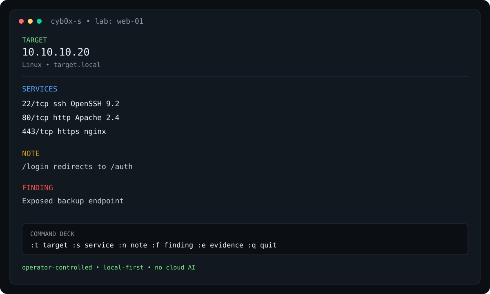

# CYB0X-S

**A local, keyboard-driven field worksheet for cybersecurity labs and practical assessments.**

<p align="center">
  
</p>

<p align="center"><strong>Run the tools. Capture what you found. Keep the investigation organized.</strong></p>

<p align="center">
  <a href="https://github.com/Mqsirrel/cyb0x-s/actions"></a>
  <a href="LICENSE"></a>
  <a href="https://github.com/Mqsirrel/cyb0x-s"></a>
</p>

CYB0X-S helps you keep track of **targets, services, findings, credentials, notes, checklists, and evidence** while you work in a terminal.

It is deliberately an **operator-controlled notebook**: you run the tools and make the decisions; CYB0X-S records and organizes the results.

> **Think field notebook, not autonomous pentesting agent.**

## Why it exists

Long lab sessions create a surprisingly simple problem: useful information ends up scattered across terminal history, text files, screenshots, and memory.

CYB0X-S keeps that working context in one local notebook without getting between you and the tools you are actually using.

```text
┌─ Terminal ───────────────────────┐
│ nmap ...                         │
│ gobuster ...                     │
│ smbclient ...                    │
└───────────────┬──────────────────┘
                │
                │  you decide what matters
                ▼
┌─ CYB0X-S ───────────────────────┐
│ Target                           │
│  ├─ Services                     │
│  ├─ Findings                     │
│  ├─ Notes                        │
│  └─ Evidence                     │
└──────────────────────────────────┘
```

## What it does

- Target and service tracking
- Findings, notes, credentials, and evidence
- Offline methodology checklists and command references
- Fast CLI capture for information you already discovered
- Local parsing of saved scan output
- Search across the local notebook
- Markdown, JSON, and text export
- SQLite storage with local-first operation
- Textual TUI with keyboard-driven navigation

CYB0X-S does **not** run scanners, exploit targets, make network connections, or call cloud AI services.

## Workflow

```text
       YOUR TOOLS
           │
           ▼
    ┌──────────────┐
    │   Discover   │
    └──────┬───────┘
           │
           ▼
    ┌──────────────┐
    │   Capture    │──── notes / services / findings / evidence
    └──────┬───────┘
           │
           ▼
    ┌──────────────┐
    │    Review    │
    └──────┬───────┘
           │
           ▼
    ┌──────────────┐
    │   Continue   │
    └──────┬───────┘
           │
           ▼
         EXPORT
```

The project is intentionally closer to a **terminal notebook** than an autonomous security tool.

## Install

```bash
git clone https://github.com/Mqsirrel/cyb0x-s.git
cd cyb0x-s
uv sync
```

Or install the package directly:

```bash
pip install -e .
```

Run the TUI with:

```bash
cyb0x-s
```

## Quick capture

```bash
# Target
cyb0x-s target 10.10.10.20 --hostname target.local --os Linux

# Service
cyb0x-s service 10.10.10.20 80/tcp HTTP --version "Apache 2.4"

# Note
cyb0x-s note "Port 80 redirects to /login"

# Finding
cyb0x-s finding "SMB anonymous access" --severity HIGH

# Search
cyb0x-s search "backup"
```

Short aliases are available for common capture commands; see `cyb0x-s --help`.

## Reference material

CYB0X-S includes offline, static reference material and methodology templates. They are intended as personal study and workflow aids, not as an automated decision engine.

The repository documents the provenance of bundled methodology material in [`docs/`](docs/).

## Project layout

```text
src/cyb0x_s/
├── db/          SQLite schema, migrations, and persistence
├── tui/         Textual application and widgets
├── cli.py       Command-line interface
├── models.py    Domain models
├── parsers.py   Local scan-output parsers
├── search.py    Local search
├── reference.py Offline command references
└── export.py    Notebook export

tests/           Automated tests
docs/            User and project documentation
scripts/         Packaging / maintenance helpers
dev/             Development-only UI tooling
examples/        Example data and configurations
```

## Development

```bash
uv sync
uv run pytest
uv run ruff check .
```

The test suite is split between fast unit/database/CLI coverage and Textual UI tests. UI tests are marked with `tui`.

See [`CONTRIBUTING.md`](CONTRIBUTING.md) for development conventions.

## Documentation

- [`docs/README.md`](docs/README.md) — documentation index
- [`docs/CYB0X-S_Operator_Guide.pdf`](docs/CYB0X-S_Operator_Guide.pdf) — operator guide
- [`docs/WORKFLOW.md`](docs/WORKFLOW.md) — intended field workflow
- [`docs/EXAM_COMPLIANCE.md`](docs/EXAM_COMPLIANCE.md) — certification-policy notes
- [`docs/EJPT_METHODOLOGY_TEMPLATES.md`](docs/EJPT_METHODOLOGY_TEMPLATES.md) — methodology templates

Certification policies change. Always verify the current rules with the relevant certification provider before using any external tool during an exam.

## License

See [`LICENSE`](LICENSE).
