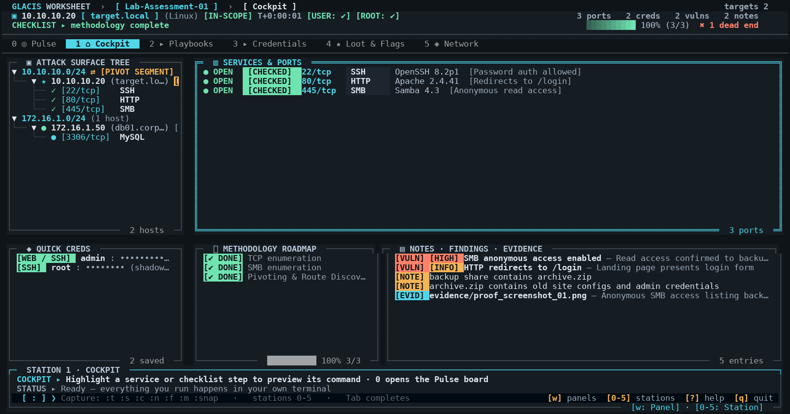

# Documentation

User-facing documentation for GLACIS. Keep this directory focused on material that helps someone install, use, or understand the project.

  

## Screenshots

`docs/screenshots/` holds one 160×44 render per station plus every modal —
regenerate them with `python dev/screenshot.py docs/screenshots [theme]`:

| File | View |
|---|---|
| `00-pulse.png` | Station 0 — Pulse triage board |
| `01-cockpit.png` | Station 1 — Cockpit (attack surface, services, methodology, notes) |
| `02-playbooks.png` | Station 2 — Playbook browser |
| `03-creds.png` | Station 3 — Credential spray matrix |
| `04-loot.png` | Station 4 — Loot, flags & rabbit holes |
| `05-network.png` | Station 5 — Documented network topology |
| `06-help.png` | Help & keybindings |
| `07-reference.png` | Reference playbook |
| `08-add-target.png` | Add target dialog |
| `09-add-service.png` | Add service dialog |
| `10-templates.png` | Methodology template picker |

For a pixel-free review (exact column alignment, truncation, spacing) use
`python dev/screentext.py <dir> 160 44`, which writes the compositor output as
plain text.

## Guides

- [Field Guide](GLACIS_Field_Guide.pdf) — detailed usage reference
- [Workflow](WORKFLOW.md) — a practical lab workflow
- [eJPT Methodology Templates](EJPT_METHODOLOGY_TEMPLATES.md) — bundled static checklists
- [Exam Compliance](EXAM_COMPLIANCE.md) — intended exam-safe usage and scope
- [Visual Design Audit](design/visual-audit.md) — station-by-station UI review and the design system behind it

## Project documentation

Implementation details and development notes belong with the code or development tooling rather than in the user documentation.

The root [README](../README.md) is the starting point for installation, features, and project overview.
